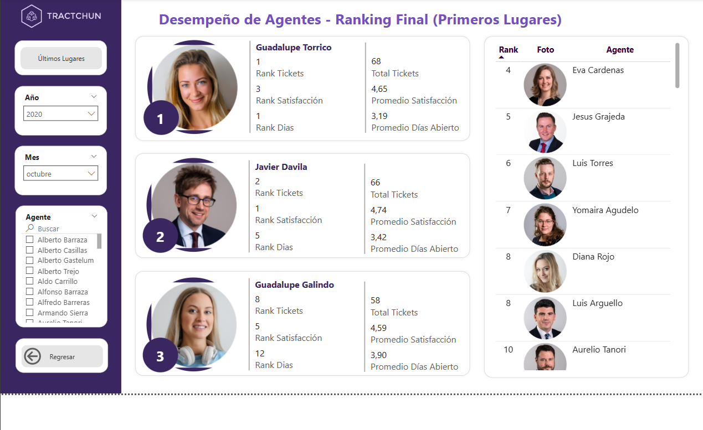

# reporte-ranking-tickets-powerbi
En este proyecto de aprendizaje trato de aprender las funciones de ALL vs ALLSELECTED, RANKX, ajustar imagenes y manejar filtros, bookmarks y sus interacciones.

## Objetivo del repositorio
El objetivo de este repositorio es calcular una serie de medidas para poder analizar los tickets que han sido manejados por los agentes de una empresa a lo largo de un tiempo determinado, pudiendo así conocer cuáles han sido los mejores trabajadores de la empresa, los peores, la distribución de carga de trabajo, entre otras. Además, se trata de aprender las mejores formas de poder visualizar y entender estos datos.

## Fuente de datos
- Curso de udemy: Microsoft Power BI - Curso de Power BI Desktop

## Captura de pantalla

## Archivo fuente
[Descargar archivo fuente](Tractchun Reporte.pbix)
